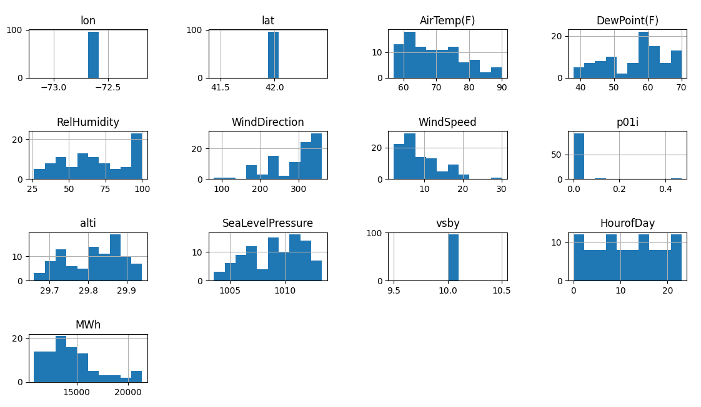
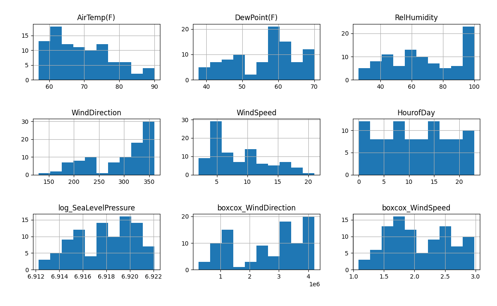
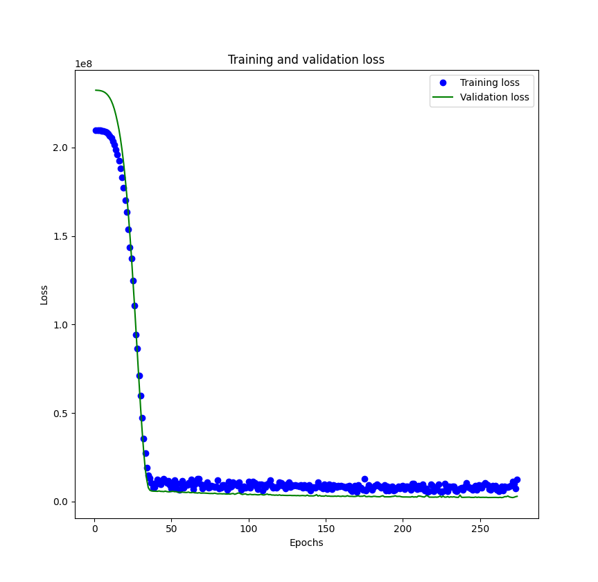
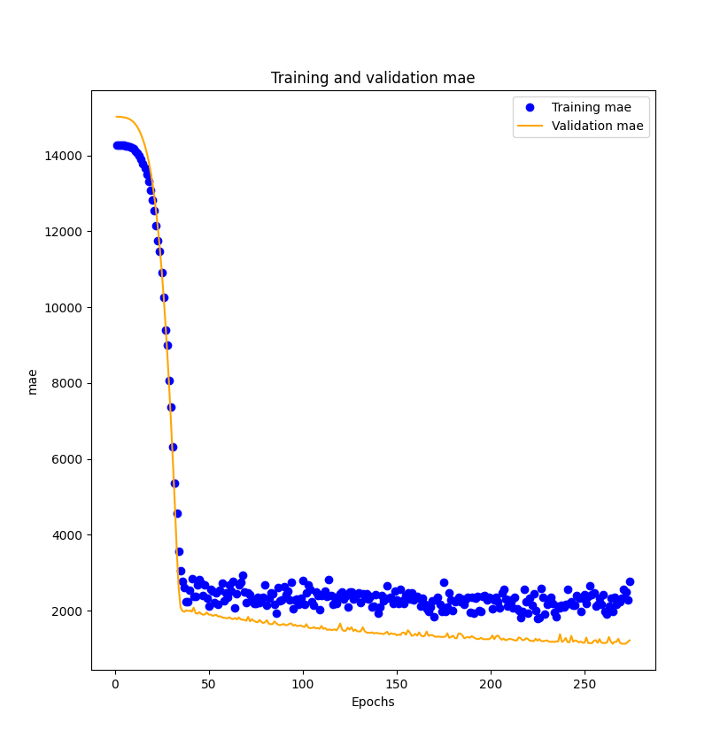
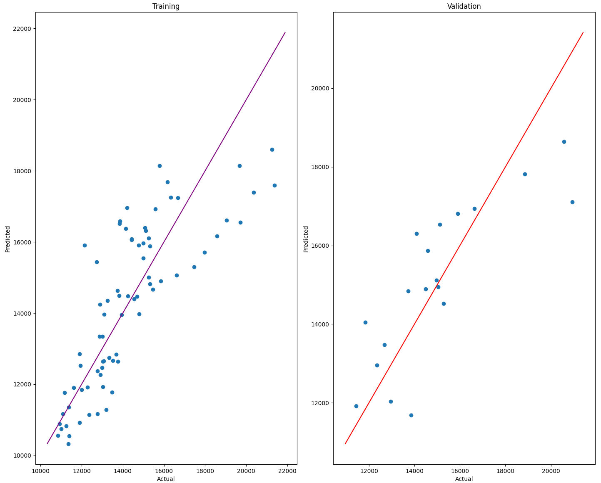

# A Feed Forward Neural Network

In this project, I took data from https://mesonet.agron.iastate.edu/request/download.phtml to perform a 
feed forward neural network (regression) that would take the hourly observations of weather in the New England area to predict energy consumption.

In this dataset, the hourly oberservations span over a few days in the month of August.

## Feature Engineering
I implemented some feature engineering to help the model's performance since the dataset is relatively small.

First, I took a look at histograms of the variables to see if we have any skewness or outliers.



Wind Speed and Wind Direction contain some outliers so, through statistical methods, I removed the outliers by calculating z-scores

``````
# get z-score of wind speed and wind direction
z_scores = zscore(df[['WindSpeed', 'WindDirection']])

# set a threshold
threshold = 3 

# identify the outliers above the threshold
outliers = (np.abs(z_scores) > threshold).any(axis=1)

# remove the outliers from the dataframe
df = df[~outliers]

``````

* Perfom Log Transformation on Sea Level Pressure to create a more normalized distribution
* Apply Box-Cox transformation on Wind Speed and Wind Direction to normalize its skewness


``````
# perform log transformation
x['log_SeaLevelPressure'] = np.log1p(x['SeaLevelPressure'])
x.drop(['SeaLevelPressure'] ,axis=1, inplace=True)

# apply box-cox transformation to WindDirection
x['boxcox_WindDirection'], _ = boxcox(x['WindDirection'] + 1)  # Adding 1 to avoid issues with zero values

# apply box-cox transformation to WindSpeed
x['boxcox_WindSpeed'], _ = boxcox(x['WindSpeed'] + 1) # Adding 1 to avoid issues with zero values

``````

Now, let's take a look at the historgrams after some feature engineering.



Slightly better!

## Model Preparations

``````
# converting to numpy array
x = np.array(x)
y = np.array(y)

# splitting the data (80/20)
x_train, x_test, y_train, y_test = train_test_split(x, y,
                                                    test_size=0.2,
                                                    random_state=16118)
print(x_train.shape, x_test.shape, y_train.shape, y_test.shape)

# using min max scaling
min_max_scaler = MinMaxScaler()
x_train = min_max_scaler.fit_transform(x_train)
x_test = min_max_scaler.transform(x_test)

``````

## Building the Model

``````
# BUILDING THE MODEL
print(x_train.shape, y_train.shape)
# defining the input shape to avoid hard coding it
x_train.shape[1]

# building the model
model = Sequential()
model.add(Dense(64, input_shape = (x_train.shape[1],), activation='relu'))
model.add(Dropout(0.1))
model.add(Dense(32, activation='relu'))
model.add(Dropout(0.1))
model.add(Dense(32, activation='relu'))
model.add(Dropout(0.1))
model.add(Dense(16, activation='relu'))
model.add(Dropout(0.1))
model.add(Dense(1, activation='linear'))
model.summary()

# compiling the model
model.compile(optimizer='RMSprop', loss = 'mse', metrics = ['mae'])

# early stopping callback
es = EarlyStopping(monitor = 'val_loss', mode = 'min', patience = 10, restore_best_weights = True)

# fitting the model
history = model.fit(x_train, y_train,
                    validation_data = (x_test, y_test),
                    callbacks=[es],
                    epochs = 800,
                    batch_size = 8,
                    shuffle = True,
                    verbose = 1)
``````
## Results

### Training vs Validation - Loss



### Training vs Validation - MAE



### Scatterplot - Actual vs Predicted



### Validation Partition Results


### Model Metrics
- **Training R2:** 0.6297123333631851
- **Test R2:** 0.6674919890916238
- **Training MAE:** 1175.8880708333334
- **Test MAE:** 1190.1061348684211
- **Training RMSE:** 2222324.8529075473
- **Test RMSE:** 2244435.5898094517

## Conclusion

In summary, the model performs well, but has room for improvement. The dataset was relatively small so 
that hinders the model's ability to perform even better. Additional data would give the model more to learn in order to make more accurate 
predictions. 

Model Metrics Summary:
- R<sup>2</sup> values closer to 1 indicate a good fit. My model has 0.63 for training and 0.67 for validation which indicates that the model performs well, but has room for improvement
- MAE (Mean Absolute Error): smaller values indicate better accuracy. It represents the absolute difference between predicted and actual values. My MAE is relatively low meaning my model's predictions are close to actual
- RMSE (Root Mean Squared Error): considers both the bias and variance of the model's prediction accuracy. Given the scale of my target variable, these are reasonable but not great.